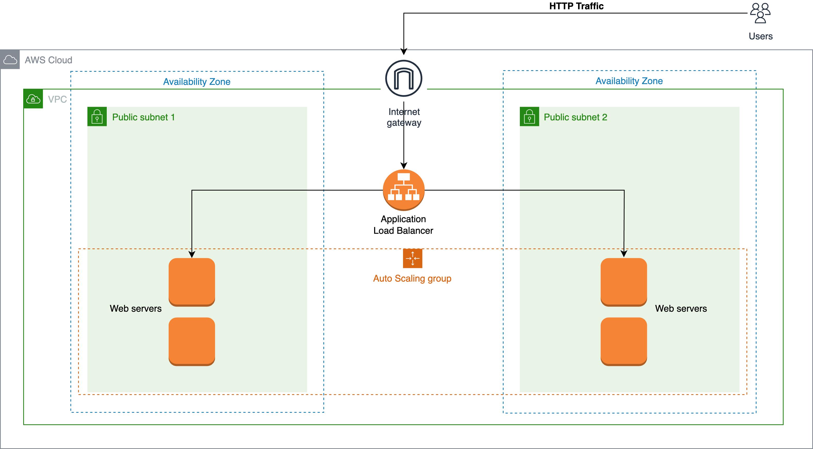

# **Create a load-balanced web server with auto scaling**

## Overview
This tutorial walks you through the process of creating web servers, managed by an auto scaling group. The auto scaling group uses a launch template to create the servers. The auto scaling group launches the servers into a target group. An internet-facing load balancer directs traffic to the target group.

Errors or corrections? Contact [mawulidenteh@gmail.com](mailto:mawulidenteh@gmail.com).

---


## Architecture Diagram



## Create a VPC
A VPC is an isolated, private network you can create to run your workloads. You have complete control over your VPC when you create one.

1. Click on [Create VPC](https://eu-west-1.console.aws.amazon.com/vpc/home?region=eu-west-1#CreateVpc:createMode=vpcWithResources) from the VPC Dashboard to create a new VPC.
2. Select **VPC and more**.
3. Enter a name under **Auto-generate**.
4. Choose a **10.0.0.0/16** IPV4 Cidr block.
5. Number of Availability Zones (AZs) = 2.
6. Number of public subnets = 2.
7. Number of private subnets = 0.
8. NAT gateways ($): None.
9. VPC endpoints = None.
10. Leave all other settings as default.
11. Click **Create VPC**.

## Demo
[](https://www.youtube.com/watch?v=9MKsavNn_pQ "Watch the Demo")

**[Click here to watch the demo](https://www.youtube.com/watch?v=9MKsavNn_pQ)**


## Create a Launch Template

The launch template will serve as the blueprint for creating the exact type of server we need to meet our web server demands. A launch template can be modified to create new versions when you need to change a configuration.

1. Click on [Create launch template](https://eu-west-1.console.aws.amazon.com/ec2/home?region=eu-west-1#CreateTemplate:) from the EC2 console to create a new launch template.
2. Launch template name - required.
3. Check the **Provide guidance to help me set up a template that I can use with EC2 Auto Scaling** box.
4. Under **Application and OS Images (Amazon Machine Image) - required**, choose **Amazon Linux 2023 AMI**.
5. Instance type = **t2.micro**.
6. Key pair - Proceed without a keypair.
7. Subnet - **Don't include in launch template**.
8. Create security group.
9. Allow HTTP traffic from 0.0.0.0/0 (Ignore the warning about security group. We will edit it later).
10. VPC - Select the VPC you created.
11. Under **Advanced network configuration**, choose **Enable** under **Auto-assign public IP**.
12. Under **Storage**, leave all other configuration as default and choose **"gp3"** for **Volume type**.
13. Resource tags: optional.
14. Under **Advanced details**, scroll down to the **User data** section and enter the following lines of code exactly as shown:

```
#!/bin/bash
yum update -y
yum install -y httpd
systemctl start httpd
systemctl enable httpd
echo "<h1>Hello World from $(hostname -f)</h1>" > /var/www/html/index.html
systemctl restart httpd
amazon-linux-extras enable epel
yum install -y stress
cat << 'EOF' > /home/ec2-user/start_stress.sh
#!/bin/bash
sleep 240
vcpus=$(nproc)
workers=$vcpus
stress --cpu "$workers" --timeout 300
EOF
chmod +x /home/ec2-user/start_stress.sh
nohup /home/ec2-user/start_stress.sh > /home/ec2-user/start_stress.log 2>&1 &

```

## Demo
[](https://www.youtube.com/watch?v=J_a9zdVQRmo "Watch the Demo")

**[Click here to watch the demo](https://www.youtube.com/watch?v=J_a9zdVQRmo)**

## Create Target Group
A target group will route requests to the web servers we create. Our load balancer will need this target group to know what set of servers to distribute traffic to. Our auto scaling group will also be associated with this target group so it launches our servers into the target group.

1. Click on [Create target group](https://eu-west-1.console.aws.amazon.com/ec2/home?region=eu-west-1#CreateTargetGroup:) from the EC2 console to create a target group.
2. Choose a target type: **Instances**.
3. Target group name: Enter a name.
4. Protocol: **HTTP**.
5. Port: **80**.
6. VPC: Select the VPC you created.
7. Leave every other value on this page as default. **Next**
8. Register Targets: Leave as is.
9. Click **Create target group**.

## Demo
[](https://www.youtube.com/watch?v=d5Uzm132PpM "Watch the Demo")

**[Click here to watch the demo](https://www.youtube.com/watch?v=d5Uzm132PpM)**

## Create Load Balancer
An application load balancer acts as the entry point for traffic to our web servers. Instead of allowing users to access our application directly, we will use the load balancer to distribute traffic equally among our autoscaling group of web servers. This is better for load management, security and reliability of our application.

1. Click on [Create load balancer](https://eu-west-1.console.aws.amazon.com/ec2/home?region=eu-west-1#SelectCreateELBWizard:) from the EC2 console to create a load balancer
2. Type: **Application Load Balancer**.
3. Scheme: **Internet-facing**.
4. IP address type: **IPV4**.
5. VPC: Select the VPC you created.
6. Mappings: Check the box beside the two AZs listed.
7. Subnet: For each AZ selected, choose the public subnet in the dropdown menu.
8. At this point, go to the Security groups console and create a new security group for the load balancer. The inbound rule should allow HTTP traffic from anywhere.
9. Select this security group as the load balancer security group.
10. Listeners and routing: Leave protocol and port as **HTTP:80**. Select the target group you created as target group.
11. Leave every other config as default and click **Create load balancer**.

## Demo
[](https://www.youtube.com/watch?v=JVyPOaC1QII "Watch the Demo")

**[Click here to watch the demo](https://www.youtube.com/watch?v=JVyPOaC1QII)**


## Create Auto Scaling Group
The auto scaling group configures and controls how your application scales automatically in response to varying traffic situations.

1. Click on [Create Auto Scaling group](https://eu-west-1.console.aws.amazon.com/ec2/home?region=eu-west-1#CreateAutoScalingGroup:) from the EC2 console to create an auto scaling group.
2. Enter a name.
3. Choose the launch template you created. Click **Next**.
4. Select your webserver VPC created from the VPC step.
5. Under **Availability Zones and subnets**, select the two public subnets in your VPC, in different AZs. Click **Next**.

***NB:** Note that you can use the auto scaling group to override your instance type config from the launch template*.

6. Under **Load balancing**, choose the option **Attach to an existing load balancer**.
7. Select **Choose from your load balancer target groups**.
8. Select the target group you created.
9. Select VPC Lattice service to attach: **No VPC Lattice service**.
10. Additional health check types - optional: **Turn on Elastic Load Balancing health checks**.
11. Leave every other config as default. **Next**.
12. Group size: Desired: **2**, Minimum: **1**, Maximum: **4**.
13. Scaling policies: **Target Tracking Policy**.
14. Metric type: **Average CPU Utilization**.
15. Target Value: **50%**.
16. **Create Auto Scaling Group**.

## Demo
[](https://www.youtube.com/watch?v=miOEZZcFtAI "Watch the Demo")

**[Click here to watch the demo](https://www.youtube.com/watch?v=miOEZZcFtAI)**


Once you successfully create your autoscaling group, you should see two new instances in the EC2 console. This is because we specified a desired count of 2. Also note that they are automatically placed one in each AZ to support high availability.


## Restrict web traffic to servers

With the current design, users can directly access our web server using its IP address. We don't want that. That is why we created a load balancer.

To ensure all incoming HTTP traffic goes through the load balancer, we will update the webserver security group to accept HTTP traffic only from our application load balancer security group.

### Edit web server security group

1. Go to the **autoscale-webserver-sg** security group and click on **Edit inbound rules**.
2. Delete the existing HTTP rule.
3. Add a new HTTP rule. In the **Source** box, scroll down to select the security group of the load balancer. **Save rules**.
4. You have successfully restricted traffic going to the servers to the load balancer.
5. You should no longer be able to access your web server using the server IPs or DNS names. You should now be able to use the load balancer DNS name to access the servers. Test this out.


## Observing Autoscaling
After launching the desired number of 2 instances, a bash script will run in the background to increase CPU utilization to 50%. This will trigger a scale out action.

This should lead to a maximum number of 4 instances being available to serve web traffic.

When the script stops running, a scale in action should equally be triggered to reduce the instances back to the desired number.

It takes about an hour to observe this.


## Conclusion
You have built a load-balanced and highly available web application that auto-scales based on a target of CPU utilization.

Delete the autoscaling group and load balancer after your tests to prevent unwanted charges.


